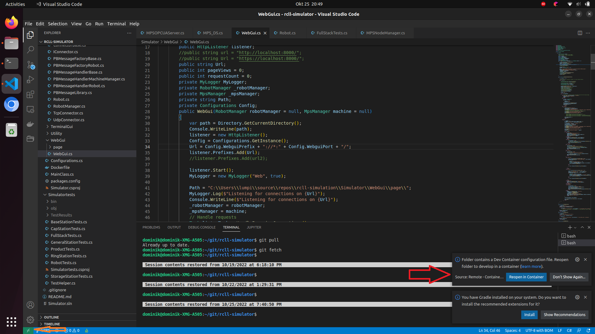
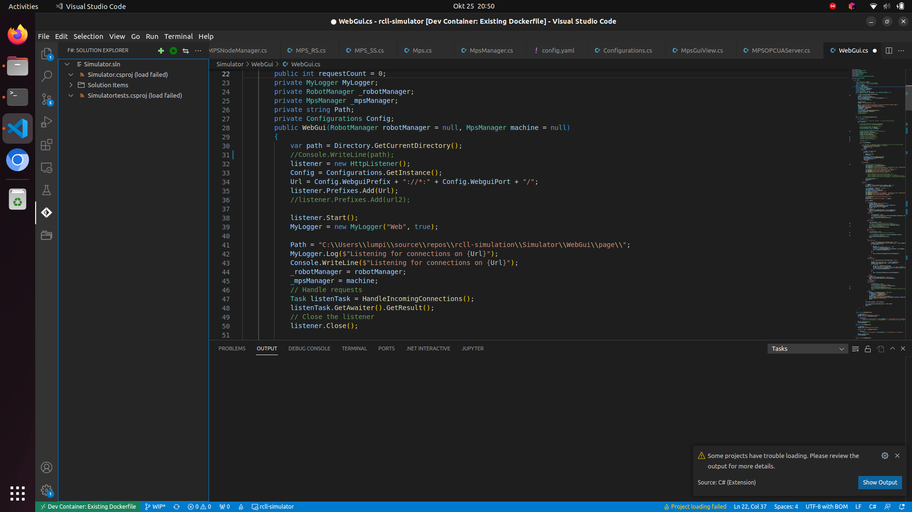
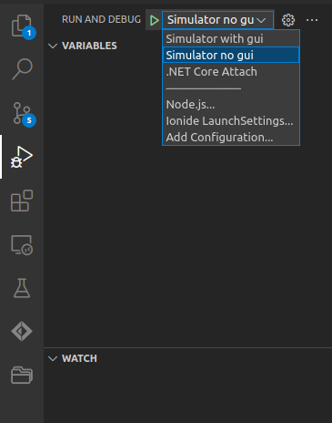

# General
Simulation of the Environment for the RoboCup Refbox and Robots.

# Setup of simulation
Currently the simulation can be started with three methods: 

## Docker
## Devcontainer
For the devcontainer you need two things. First Visual Studio Code installed with the Dev Container addon installed. Secondly you need docker installed on your machine. Once both are set in place all you have to do is open the repository in visual studio code and it will already suggest to open the code in the devcontainer. 

If the box marked with the red arrow is not visible you can alternatively click on the green box marked with the orange arrow.

This is the preferred way as you can easily change the config and other things as everything will be already in place for you once the container is finished with the setup and build.

Once the setup is done you can change the config you should see a debugging plugin that suggests you two different tasks to run.

The with GUI task is using the shell-gui that will be deprecated in future versions as we will switch to an browser based gui for future releases.

## Single Container
First of all you need to change go into the Simulator directory to build the container locally (in future versions the container will also be directly available via the github docker repo).
To build the image all you need to do is: 
> docker build -t [your prefered image name] .

Once the docker images has been build you can start the simulation docker container with the command:

 simulation with docker you need to change into the directory Simulator and run the command:
>docker run -t --network=host --name=[fancy container name] [your prefered image name] bash -c "dotnet run --framework net6.0 -cfg cfg/config.yaml"

the --name is not needed but you can change the name of the container if you like to do so.
Currently the container might stay open on ctrl+c so you need to kill the container with
> docker kill [fancy container name]

if no name was given to the container it is a default name that can be found either by 
> docker ps

or by pressing tab if you only have this single container running.

## Natively
### Windows
For windows you can simply download a version of the visual studio IDE that you like and open the project with the IDE and run the program.

### Linux
You could install the .net environment on your machine. For instructions how to install the .net core please visit one of the following:

German:
[Installieren von .NET unter Linux](https://learn.microsoft.com/de-de/dotnet/core/install/linux)

English:
[Install.NET on Linux](https://learn.microsoft.com/en-gb/dotnet/core/install/linux)

Currently the system is running on net6.0 so this should be the preferred version. 
Once downloaded you can build the project once you switch into the Simulator directory run 
> dotnet build

After the building you can run the project with

> dotnet run -cfg [path/to/your/config.yaml]

# Troubleshooting 

This part will be improved in future commits.

